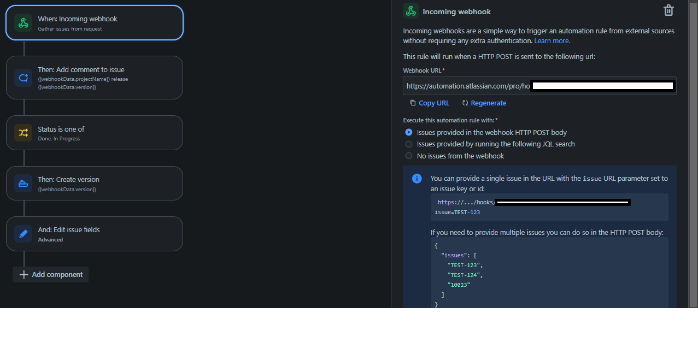
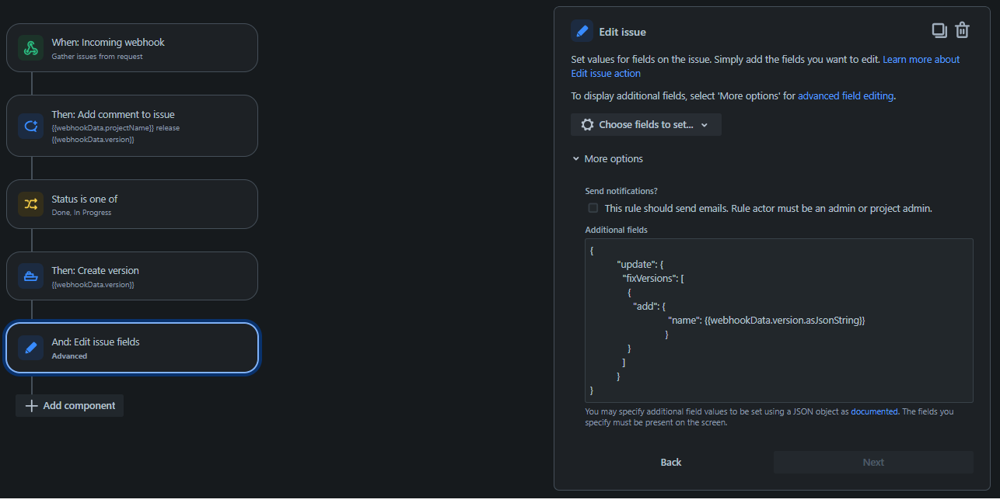

# create-jira-release (GitHub Action)

Creates a new Jira release for a specific Jira project and assigns all relevant* Jira issue numbers to it.
\* All Jira issue numbers (e.g. TEST-123) in commit messages since last Git tag.

## Prerequisites

In order to be able to use this GitHub Action, a custom Jira automation rule needs to be created first. Please refer to the screenshot below for the most important settings.

## Options

| key                       | description                           | required |
| ------------------------- | ------------------------------------- | -------- |
| `jira-project-key`        | Jira project identifier (e.g. _TEST_) | true     |
| `jira-automation-webhook` | Jira automation webhook url           | true     |

## Secrets

| key                               | description                                                                                                         | required |
| --------------------------------- | ------------------------------------------------------------------------------------------------------------------- | -------- |
| `secrets.JIRA_AUTOMATION_WEBHOOK` | Can be obtained or regenerated in the _Incoming webhook_ automation step of the corresponding Jira automation rule. | true     |

## License

The scripts and documentation in this project are released under the [MIT License](LICENSE)
